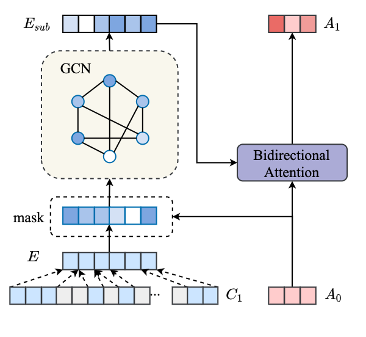

# Multi-hop Question Generation with Graph Convolutional Network (MulQG)
 [](https://opensource.org/licenses/MIT) 


This is the implementation of the paper:

**Multi-hop Question Generation with Graph Convolutional Network**. **[Dan Su](https://github.com/Iamfinethanksu)**, [Yan Xu](https://yana-xuyan.github.io), [Wenliang Dai](https://wenliangdai.github.io), Ziwei Ji, Tiezheng Yu, Pascale Fung **Findings of EMNLP 2020** [[PDF]](https://www.aclweb.org/anthology/2020.findings-emnlp.416.pdf)

If you use any source codes or datasets included in this toolkit in your work, please cite the following paper. The bibtex is listed below:
<pre>
@inproceedings{su2020multi,
  title={Multi-hop Question Generation with Graph Convolutional Network},
  author={Su, Dan and Xu, Yan and Dai, Wenliang and Ji, Ziwei and Yu, Tiezheng and Fung, Pascale},
  booktitle={Proceedings of the 2020 Conference on Empirical Methods in Natural Language Processing: Findings},
  pages={4636--4647},
  year={2020}
}
</pre>

## Abstract

Multi-hop Question Generation (QG) aims to generate answer-related questions by *aggregating* and *reasoning* over multiple scattered evidence from different paragraphs. It is a more challenging yet under-explored task compared to conventional single-hop QG, where the questions are generated from the sentence containing the answer or nearby sentences in the same paragraph without complex reasoning. To address the additional challenges in multi-hop QG, we propose Multi-Hop Encoding Fusion Network for Question Generation (MulQG), which does context encoding in multiple hops with Graph Convolutional Network and encoding fusion via an Encoder Reasoning Gate. To the best of our knowledge, we are the first to tackle the challenge of multi-hop reasoning over paragraphs without any sentence-level information. Empirical results on HotpotQA dataset demonstrate the effectiveness of our method, in comparison with baselines on automatic evaluation metrics. Moreover, from the human evaluation, our proposed model is able to generate fluent questions with high completeness and outperforms the strongest baseline by 20.8% in the multi-hop evaluation.

## MulQG Framework:
<p align="center">

</p>

Overview of our MulQG framework. In the encoding stage, we pass the initial context encoding C_0 and answer encoding A_0 to the *Answer-aware Context Encoder* to obtain the first context encoding C_1, then C_1 and A_0 will be used to update a multi-hop answer encoding A_1 via the *GCN-based Entity-aware Answer Encoder*, and we use A_1 and C_1 back to the *Answer-aware Context Encoder* to obtain C_2. The final context encoding C_{final} are obtained from the *Encoder Reasoning Gate* which operates over C_1 and C_2, and will be used in the max-out based decoding stage.

<p align="center">

</p>

The illustration of GCN-based Entity-aware Answer Encoder.


## Dependencies
python 3, pytorch, boto3

Or you can use `conda` environment yml file (multi-qg.yml) to create your conda environment by running
```
conda env create -f multi-qg.yml
```
or try the 
```
pip install -r requirement.txt
```

## Experiments

### Download Data

#### HotpotQA Data
Download the [hotpot QA train and test data](https://github.com/hotpotqa/hotpot) and put them under `./hotpot/data/`.

#### Glove Embedding
Download the glove embedding and unzip 'glove.840B.300d.txt' and put it under `./glove/glove.840B.300d.txt`

#### Bert Models
We use the Bert models in the paragraph selection part.
You should download and set bert pretrained model and vocabulary properly.
You can find the download links in *paragraph_selection/pytorch_pretrained_bert/modeling.py* row **40-51**, and *paragraph_selection/pytorch_pretrained_bert/tokenization.py* row **30-41**.
After you finish downloading, you should replace the dict value with your own local path accordingly.

### Preprocessed Data

You can directly download our preprocessed train & dev data of HotpotQA from the [link](https://drive.google.com/drive/folders/1zV03LosHm55RLOJoRoF0KwXB9bm7Z7zH?usp=sharing) 

Extract all compressed files into **./hotpot/** folder.

Also you can preprocess by yourself following the instructions in the next section.

### Preprocess 

Previously we provided intermediate data files for training MulQG. Now you can also run the following preprocessing.
The preprocessing phase consists of paragraph selection, named entity recognition, and graph construction.


* Step 1.1: First, download model checkpoints and save them in **./work_dir** 
  - [bert_ner.pt](https://drive.google.com/file/d/1KneaQDpZ3uWXUEQCS-nC4OQQT8VBsLJr/view?usp=sharing)
  - [para_select_model.bin](https://drive.google.com/file/d/10kTPjd-OXXROzqAyz8vVuWBNvuwolHA1/view?usp=sharing)


* Step 2: Run the data preprocessing (change the input and output path to your own)
```
sh ./run_preprocess.sh
```

* Step 3: Run the process_hotpot.py (to obtain the `embedding.pkl` and `word2idx.pkl`)


### Released Checkpoints

We also released our pretrained model for reproduction.
* [MulQG_BFS.tar.gz](https://drive.google.com/file/d/1NCMDg8j3VsvQ3ul1FjBk6l_TT9c7urQB/view?usp=sharing)

### Training

* Step 4: Run the training  

```
sh ./run_train.sh 
```

```
python3 -m GPG.main --use_cuda --schedule --ans_update --q_attn --is_coverage --use_copy --batch_size=36 --beam_search --gpus=0,1,2 --position_embeddings_flag

```
Change the configuration file in *GPG/config.py* with proper data path, eg, the log path, the output model path, so on.
If an OOM exception occurs, you may try to set a smaller batch size with gradient_accumulate_step > 1.
Your checkpoints in each epoch will be stored in  *./output/* directory respectively. or you can change the path in *GPG/config.py*.

### Inference

* Step 5: Do the inference, and the prediction results will be under *./prediction/*  (you may modify other configurations in *GPG/config.py* file)
```
sh ./run_inference.sh
```
You can do the inference using our released model [MulQG_BFS.tar.gz](https://drive.google.com/file/d/1NCMDg8j3VsvQ3ul1FjBk6l_TT9c7urQB/view?usp=sharing), with the following command:

```
python3 -m GPG.main --notrain --max_tgt_len=30 --min_tgt_len=8 --beam_size=10 --use_cuda --ans_update --q_attn --is_coverage --use_copy --batch_size=20 --beam_search --gpus=0 --position_embeddings_flag --restore="./output/GraphPointerGenerator/MulQG_BFS_checkpoint.pt"

```

### Evaluation

* Step 6: Do the evaluation. We calculate the **BLEU** and **METOR**, and **ROUGE** score via [**nlg-eval**](https://github.com/Maluuba/nlg-eval), and the **Answerability** and **QBLEU** metrics via [Answeriblity-Metric](https://github.com/PrekshaNema25/Answerability-Metric). You may need to install them.

We also upload our prediction output as in *./prediction/* directory, using *nlg-eval* packages via:

```
nlg-eval --hypothesis=./prediction/candidate.txt --references=./predictioin/golden.txt
```

you will get *nlg-eval* results like:

```
Bleu_1: 0.401475
Bleu_2: 0.267142
Bleu_3: 0.197256
Bleu_4: 0.151990
METEOR: 0.205085
ROUGE_L: 0.352992
```

Also, follow the instructions [Answeriblity-Metric](https://github.com/PrekshaNema25/Answerability-Metric) to measure the *Answerability* and *QBLEU* metircs.

```
python3 answerability_score.py --data_type squad --ref_file ./prediction/golden.txt --hyp_file ./prediction/candidate.txt --ner_weight 0.6 --qt_weight 0.2 --re_weight 0.1 --delta 0.7 --ngram_metric Bleu_4
```
then you will get the *QBLEU4* as in (according to the paper, this should be the QBLEU-4 value, just ignore the words)

```
Mean Answerability Score Across Questions: 0.540
```

```
python3 answerability_score.py --data_type squad --ref_file ./prediction/golden.txt --hyp_file ./prediction/candidate.txt --ner_weight 0.6 --qt_weight 0.2 --re_weight 0.1 --delta 1.0 --ngram_metric Bleu_4
```

then you will get the *Answerability* :
```
Mean Answerability Score Across Questions: 0.728
```
